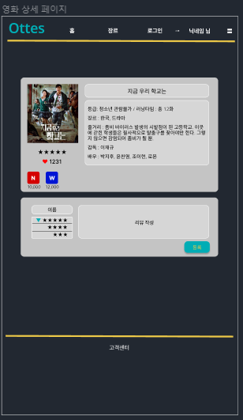

# 코딩해조

### 역할


```
● 유성현 : 형상관리 - 코드승인 , 저장소,관리                                  ○ 컨텐츠 리뷰, ott관리, 통계

● 이기주 : 이슈 및 리스크 관리 - 프로젝트의 예상 위험요소, 오류 상황           ○ 템플릿, 회원목록 관리
 
● 민유경 : 데이터 베이스 관리 - ERD 수정/관리, 테이블 생성 / 변경/ 관리        ○ 컨텐츠 등록, 통계

● 이유나 : UI 관리 - 홈페이지 화면에 대한 설계, flow, 예상기능 등에 대한 관리  ○ 컨텐츠 상세, 컨텐츠 검색
 
● 천지연 : UI 관리 - 홈페이지 화면에 대한 설계, flow, 예상기능 등에 대한 관리  ○ 게시판, 메인페이지, 컨텐츠검색

● 송현도 : 일정 및 회의 관리 (프로젝트 매니저) - 전체 진행일정 조율, 관리 담당  ○ 회원 정보, 회원가입
```


## 주제

### 선택한 콘텐츠를 제공하는 OTT의 종류와 OTT 월별 가격을 비교하는 사이트
***

+ 롤모델 사이트 : <https://www.justwatch.com/kr>

+ ERD주소 : <https://www.erdcloud.com/d/jxvri2DP6RiyLcoXe>

+ Flow Chart : https://app.diagrams.net/#Hzdx456%2FSemiProject-1%2Fmain%2Fsemi-1.drawio


+ font : Noto Sans Korean - https://fonts.google.com/noto/specimen/Noto+Sans+KR

+ Screen form : https://www.figma.com/file/ui61FPwGa3Nb15vadIXM3X/%EC%BD%94%EB%94%A9%ED%95%B4%EC%A1%B0-team-library?node-id=414%3A2


## 디자인, 초안과 비교


　　　　　

　　　　　

+ 폰트 : Noto Sans Korean - https://fonts.google.com/noto/specimen/Noto+Sans+KR

+ 모든 초안 디자인 : https://www.figma.com/file/ui61FPwGa3Nb15vadIXM3X/%EC%BD%94%EB%94%A9%ED%95%B4%EC%A1%B0-team-library?node-id=414%3A2


##  기능 구현


| 기능 | 구현 | 기능 내용 |
| ------ | ------ | ----------- |
| ? | ☑️ | ? |
| ? | ☑️ |? |
| ? | ☑️ |? |
| ? | ☑️ | ? |
| ? |  | ? |
| ? |  | ? |
| ? |  | ? |
| ? |  | ?  |


***
## ○참고문서

<https://gist.github.com/ihoneymon/652be052a0727ad59601>

<https://mini-min-dev.tistory.com/56>
