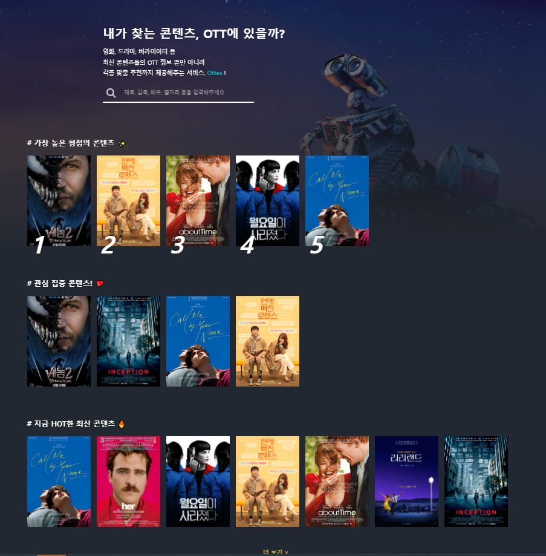

# 코딩해조    

### 역할

```
● 유성현 : 형상관리 - 코드승인 , 저장소,관리 

● 이기주 : 이슈 및 리스크 관리 - 프로젝트의 예상 위험요소, 오류 상황       
 
● 민유경 : 데이터 베이스 관리 - ERD 수정/관리, 테이블 생성 / 변경/ 관리   

● 이유나 : UI 관리 - 홈페이지 화면에 대한 설계, flow, 예상기능 등에 대한 관리  
 
● 천지연 : UI 관리 - 홈페이지 화면에 대한 설계, flow, 예상기능 등에 대한 관리  

● 송현도 : 일정 및 회의 관리 (프로젝트 매니저) - 전체 진행일정 조율, 관리 담당
```

### 개발 당담

```
● 유성현 : 콘텐츠 리뷰 CRUD , ott CRUD , 통계(가입일, ott컨텐츠 개수)

● 이기주 :  템플릿(해더, 푸터, 햄버거 버튼) , 회원목록 관리 CRUD
 
● 민유경 : 콘텐츠 CRUD (포스터,ott 등록), 통계 (연령별,성별,장르별, ott별)

● 이유나 : 콘텐츠 상세(관심컨텐츠), 리뷰(등록 조회), 콘텐츠 검색(비동기통신 정렬)
 
● 천지연 : 게시판 CRUD(고객센터,1:1문의), 메인페이지(슬라이더, 정렬), 텐츠검색(비동기통신 정렬)

● 송현도 : 회원 CRUD (중복검사), Id/Pw 찾기, 마이페이지
```


## 주제

***
### 선택한 콘텐츠를 제공하는 OTT의 종류와 OTT 월별 가격을 비교하는 사이트
***

## 주제 선정 이유
***
1. Ott 이용자 증가 - Ott 이용이 증가하는 추세(2020년 66.3%,2021년 69.5% 출처 : 2021년 방송매체 이용행태 조사)

2. Ott 종류 증가 - Ott 종류가 증가함에 따라 이용자의 Ott 선택 

3. 합리적인 선택을 지원 - 특정 컨텐츠를 제공하는 Ott 종류와 월별 가격을 제공하여 합리적 선택을 도와준다

## 개발환경
***
* 운영체제 - window10, window11


* 사용 언어 - java 1.8(JDK 1,8), Oracle 21.4.3, JavaScript, HTML


* IDE(개발환경) - Eclipse(4.22.0), Visual Studio Code(1.67.1)

## 설계

+ 롤모델 사이트 : <https://www.justwatch.com/kr>

+ ERD주소 : <https://www.erdcloud.com/d/jxvri2DP6RiyLcoXe>
 


+ usecase Diagram : 
 
 
+ Flow Chart : https://app.diagrams.net/#Hzdx456%2FSemiProject-1%2Fmain%2Fsemi-1.drawio


## 디자인, 초안과 비교

                 초안                                                     개발화면
　　　　　

　　　　　

+ 폰트 : Noto Sans Korean - https://fonts.google.com/noto/specimen/Noto+Sans+KR

+ 모든 초안 디자인 : https://www.figma.com/file/ui61FPwGa3Nb15vadIXM3X/%EC%BD%94%EB%94%A9%ED%95%B4%EC%A1%B0-team-library?node-id=414%3A2


## 주요 기능 구현 여부


| 기능 | 구현 | 기능 내용 |
| ------ | ------ | ----------- |
| 관심콘텐츠 | ☑️ | 하트를 눌러 관심콘텐츠 등록 |
| 포스터 출력 | ☑️ | 콘텐츠 등록시 첨부파일 업로드,다운로드 관리 |
| 검색 | ☑️ | 검색시 비동기통신을 이용한 정렬 |
| 회원정보관리 | ☑️ | 선택한 장르, 가입한Ott 수정과 등록가능 |
| 메인페이지 | ☑️ | 별점순, 관심순, 내가 관심을 선택한 콘텐츠 목록 출력|
| 통계 | ☑️ | 가입일, 성별, 연령별, Ott별 콘텐츠 |
| 리뷰 | ☑️ | 별점 부여, 등록, 수정, 삭제 |
| 게시판 | ☑️ | 1:1문의, 공지, 답변  |
| 콘텐츠 | ☑️ | 콘텐츠 정보, 배우, 제공Ott, 장르, 상세보기(별점,관심컨텐츠,리뷰) |
| Ott | ☑️ | 로고 첨부, 수정, 삭제, 등록  |
| 예고편 | 🔺 | 콘텐츠 상세보기에서 동영상 삽입  |
| 영화 월드컵 | 🔺 | 월드컵 기능을 이용하여 선호 콘텐츠 제공  |


## 체크리스트 체크

* 크로스 체킹을 통해 개발하지 않은 파트를 체크함

* 체크리스트 전체 : https://docs.google.com/spreadsheets/d/1OokltEsb8Sa3Pvoue279jifhWzBXDaaLW_sOCUll_XE/edit#gid=0


## 포스터 저작권에 대한 문제 

*  영화를 소개하기 위해 또는 영화 감상평을 쓰기 위해 영화 포스터를 사용하는 것은 저작권법 위반이 아니다.
*  이렇게 사용하는 것은 허용되어 있는 사용범위에 속한다. 
*  굳이 저작권자를 찾아서 사용허락을 받을 필요도 없다.
*  저작권 28조에서 정당한 인용의 방식으로 사용하는 것은 저작권 위반이 아니라고 규정하고 있기 때문이다.  
*  단 출처는 명시해야 한다.
*  일반적으로 영화 포스터는 포스터 자체에 영화 제목이나 배우, 영화 제작사 등 각종 정보가 들어 있기 때문에 그 자체가 영화 출처라고 볼만하다. 
  
  
                            출처: https://www.copycat.or.kr/45 [한국저작권교육센터]


* 제28조(공표된 저작물의 인용) 공표된 저작물은 보도ㆍ비평ㆍ교육ㆍ연구 등을 위하여는 정당한 범위 안에서 공정한 관행에 합치되게 이를 인용할 수 있다. //국가법령 정보센터
***
## ○참고문서

<https://gist.github.com/ihoneymon/652be052a0727ad59601>

<https://mini-min-dev.tistory.com/56>
